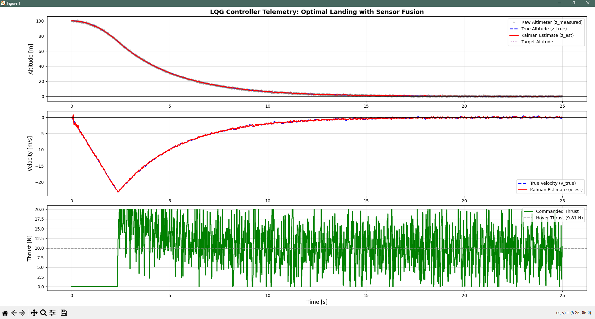
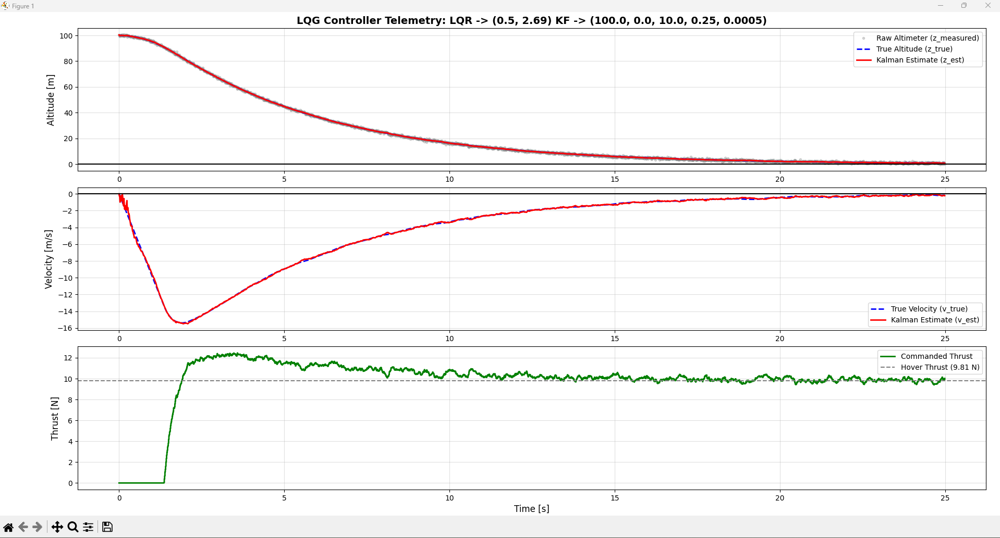

# Project Overview: 1D Vertical Rocket Landing Simulator (LQG)

This project simulates a 1D vertical landing maneuver of a 1 kg rocket. The goal was for the vehicle to descend from 100 m and touch down at 0 m at near-zero velocity. 

I initially built this to practice modern C++ memory management and validate my custom physics engine using a standard PID controller. However, the core of the project evolved into developing **Linear Quadratic Gaussian (LQG)** controller capable of handling real-world sensor noise and preventing actuator saturation.

## System Architecture
* **Language:** C++17
* **Physics Engine:** Custom 4th-Order Runge-Kutta (RK4) Integration (0.01s time step). I used this over Euler to accurately capture jerk during thrust transients.
* **State Estimation:** Custom Kalman Filter to fuse the noisy sensor data with the internal physics model.
* **Control Law:** State-space LQR tuned by Bryson's Rule.
* **Telemetry:** C++ CSV output parsed by a Matplotlib visualization script.

## Development Phases

### Phase 1: Physics Validation (PID)
To test my C++ physics loop, I started with a basic Proportional-Integral-Derivative (PID) controller. To prevent the rocket from crashing while the Integral term was learning to deal with gravity, I put in a 9.81 N feed-forward baseline. 
* **Result:** Landed successfully in 9.31s, but with a hard touchdown velocity (-2.50 m/s). I would consider the PID controller as too reactive and completely unstable when introduced to raw sensor noise, which does make sense as it was fine tuned before to perfect 1D conditions.

### Phase 2: Sensor Fusion (Kalman Filter)
In physical hardware, altimeter sensors have static. To account for this in the simulation, I put simulated noise into the altitude readings. To prevent the flight computer from reacting to the new false data, I engineered a Kalman Filter. By aggressively tuning the Process Noise ($Q = 0.0005$), the filter trusts the mathematically smooth RK4 physics model over the raw altimeter, generating a clean velocity and altitude estimate. 

### Phase 3: Resolving Actuator Saturation
Even with filtered data, my initial LQR gains ($K_1 = 10.0, K_2 = 31.62$) were too aggressive. The controller suffered from sensor noise over-amplification. It took the 1% of noise that slipped through the Kalman Filter and amplified it into violent thrust commands, slamming the simulated engine between 0 N and 20 N hundreds of times a second (chattering), shown below.

In order to solve for my new LQR gains, I learned about Bryson's rule, that helps calculate the Q and R matricies using the inverse square of the maximum allowed physical limits:

$$Q_{ii} = \frac{1}{\text{maximum acceptable error}^2}$$
$$R_{ii} = \frac{1}{\text{maximum acceptable control effort}^2}$$

For this 1 kg rocket, I put strict physical constraints to protect the engine valves and ensure a soft touchdown:
* **Max Altitude Error ($z_{max}$):** $10$ m
* **Max Velocity Error ($v_{max}$):** $2$ m/s
* **Max Thrust Variation ($u_{max}$):** $5$ N 

Applying these limits yields the following matrices:

$$Q = \begin{bmatrix} \frac{1}{10^2} & 0 \\ 0 & \frac{1}{2^2} \end{bmatrix} = \begin{bmatrix} 0.01 & 0 \\ 0 & 0.25 \end{bmatrix}$$

$$R = \begin{bmatrix} \frac{1}{5^2} \end{bmatrix} = \begin{bmatrix} 0.04 \end{bmatrix}$$

By heavily penalizing the control effort ($R = 0.04$), the Continuous Algebraic Riccati Equation (CARE) solver is forced to prioritize engine safety over aggressive altitude corrections. This generated a new set of highly optimized, smooth feedback gains:

$$K = \begin{bmatrix} 0.5 & 2.69 \end{bmatrix}$$

Now, instead of fighting the sensor noise, the controller would use the gains to allow the engine to decelerate the rocket in a way that safely touches the ground without extreme chattering that could damage the engine. 

## Final Results

After implementing the Bryson tuned gain matricies, I was able to almost completely eliminate the actuator chattering. The rocket now optimizes a fuel-saving free fall, using throttles to catch itself without putting stress on the engine valves, and touches down at 0 meters, shown below.

